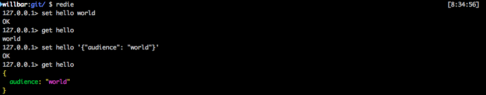

# Redie
Redis client focused on providing a delightful user experience.



# Usage
Connect to your Redis server by passing the following command-line arguments (or setting their environment variable equivalents):
```
  -h      Hostname to connect to (defaults to 127.0.0.1 or REDIS_HOSTNAME environment variable)
  -p      Port to connect to (defaults to 6379 or REDIS_PORT environment variable)
  -a      Password to use to connect (defaults to REDIS_PASSWORD environment variable)
  --tls   Use TLS to connect (defaults to on if REDIS_TLS environment variable is set)
```

Once connected you'll be placed in a "Redie shell" where you can execute commands against the Redis server you connected to:
```
hostname>
```

# Commands
Redie supports the full set of Redis commands with the exception of:
* `BATCH`, `MULTI`
* `SUBSCRIBE`, `UNSUBSCRIBE`, `PSUBSCRIBE`, `PUNSUBSCRIBE`

Redie also adds the following commands:
* `HELP [pattern]` lists the Redis commands matching the specified pattern (wildcards supported)
* `SAVE filename` saves the output of the last command to the specified filename overwriting it if it already exists
* `QUIT` exits the Redie shell

# Roadmap
* Support for subscriptions
* Support for BATCH and MULTI
* Formatting for more types (e.g. HTML)
* Extensible formatting
* Command-line arguments to run a command (and optionally exit)
* Run commands from a file (both from the command-line and the shell)

# Contributing
Pull requests will gladly be considered!